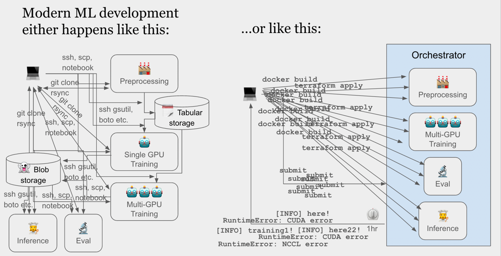
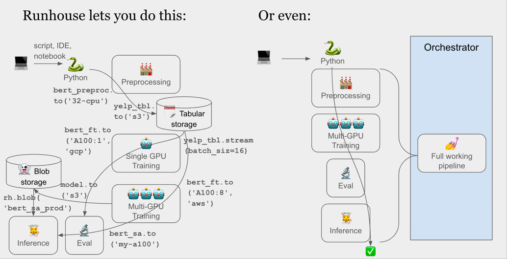

<h1 align="center">🏃‍♀️ Runhouse 🏠</h1>

[//]: # (<p align="center">)

[//]: # (  <a href="https://discord.gg/RnhB6589Hs"> )

[//]: # (    )

[//]: # (  </a>)

[//]: # (</p>)

## 🚨 Caution: This is an Alpha 🚨

Runhouse is heavily under development. We are sharing
it with a few select people to collect feedback, and
expect to iterate on the APIs considerably before reaching beta
(version 0.1.0).

## 👵 Welcome Home!
Runhouse is for ML Researchers, Engineers, and Data Scientists who are tired of: 
 - 🚜 manually shuttling code and data around between their local machine, remote instances, and cloud storage,
 - 📤📥 constantly spinning up and down boxes,
 - 🐜 debugging over ssh and notebook tunnels,
 - 🧑‍🔧 translating their code into a pipeline DSL just to use multiple hardware types,
 - 🪦 debugging in an orchestrator,
 - 👩‍✈️ missing out on fancy LLM IDE features,
 - 🕵️ and struggling to find their teammates' code and data artifacts.

By way of a visual,




PyTorch lets you send a Python function or tensor `.to(device)`, so
why can't you do `my_fn.to('a_gcp_a100')` or `my_table.to('parquet_in_s3')`?
Runhouse allows just that: send code and data to any of your compute or
data infra (with your own cloud creds), all in Python, and continue to use them
eagerly exactly as they were. Take a look at this code (adapted from our first [tutorial](https://github.com/run-house/tutorials)):
```python
import runhouse as rh
from diffusers import StableDiffusionPipeline
import torch

def sd_generate(prompt, num_images=1, steps=100, guidance_scale=7.5, model_id='stabilityai/stable-diffusion-2-base'):
    pipe = StableDiffusionPipeline.from_pretrained(model_id, torch_dtype=torch.float16, revision='fp16').to('cuda')
    return pipe([prompt] * num_images, num_inference_steps=steps, guidance_scale=guidance_scale).images

if __name__ == "__main__":
    gpu = rh.cluster(name='rh-v100', instance_type='V100:1', provider='gcp')
    generate_gpu = rh.send(fn=sd_generate).to(gpu, reqs=['./', 'torch==1.12.0', 'diffusers'])

    images = generate_gpu('A digital illustration of a woman running on the roof of a house.', num_images=2, steps=50)
    [image.show() for image in images]

```
There's no magic yaml, DSL, code serialization, or "submitting for execution." We're 
just spinning up the cluster for you (or using an existing cluster), syncing over your code,
starting a gRPC connection, and running your code on the cluster.

**_Runhouse does things for you that you'd spend time doing yourself, in as obvious a way as possible._**

And because it's not stateless, we can pin the model to GPU memory, and get ~1.5s/image
inference before any compilation.

On the data side, we can do things like:
```python
# Send a folder up to a cluster (rsync)
rh.folder(url=input_images_dir).to(fs=gpu, url='dreambooth/instance_images')        

# Stream a table in from anywhere (S3, GCS, local, etc)
preprocessed_yelp = rh.table(name="preprocessed-tokenized-dataset")
for batch in preprocessed_table.stream(batch_size=batch_size):
    ...

# Send a model checkpoint up to blob storage
trained_model = rh.blob(data=pickle.dumps(model))
trained_model.to('s3', url='runhouse/my_bucket').save(name='yelp_fine_tuned_bert')
```

These APIs work from anywhere with a Python interpreter and an internet connection,
so notebooks, scripts, pipeline DSLs, etc. are all fair game. We currently support AWS,
GCP, Azure, and Lambda Labs credentials through SkyPilot, as well as BYO cluster (just drop 
in an ip address and ssh key). 

## 👨‍🏫 Tutorials / API Walkthrough

[Can be found here](https://github.com/run-house/tutorials).

## 🙋‍♂️ Getting Help

Please join our [discord server here](https://discord.gg/RnhB6589Hs)
to message us, or email us (donny at run.house or josh at run.house), or create an issue.

## 🐣 Getting Started

tldr;
```commandline
pip install runhouse
sky check
# Optionally, for portability (e.g. Colab):
runhouse login
```

### 🔌 Installation

⚠️ On Apple M1 or M2 machines ⚠️, you will need to install grpcio with conda
before you install Runhouse - more specifically, before you install Ray.
If you already have Ray installed, you can skip this.
[See here](https://docs.ray.io/en/master/ray-overview/installation.html#m1-mac-apple-silicon-support)
for how to install grpc properly on Apple silicon. You'll only know if you did
this correctly if you run `ray.init()` in a Python interpreter. If you're
having trouble with this, let us know.

Runhouse can be installed with:
```
pip install runhouse
```
As this is an alpha, we push feature updates every few weeks as new microversions.

### ✈️ Verifying your Cloud Setup with SkyPilot

Runhouse uses [SkyPilot](https://skypilot.readthedocs.io/en/latest/) for
much of the heavy lifting with launching and managing cloud instances.
We love it and you should [throw them a Github star ⭐️](https://github.com/skypilot-org/skypilot/).

To verify that your cloud credentials are set up correctly, run
```
sky check
```
in your command line. This will confirm which cloud providers are ready to
use, and will give detailed instructions if any setup is incomplete.

All Runhouse compute are SkyPilot clusters right now, so you should use
their CLI to do basic management operations. Some important ones are:
* `sky status --refresh` - Get the status of the clusters *you launched from
this machine*. This will not pull the status for all the machines you've
launched from various environments. We plan to add this feature soon.
* `sky down --all` - This will take down (terminate, without persisting the
disk image) all clusters in the local SkyPilot context (the ones that show
when you run `sky status --refresh`). However, the best way to confirm that you don't
have any machines left running is always to check the cloud provider's UI.
* `sky down <cluster_name>` - This will take down a specific cluster.
* `ssh <cluster_name>` - This will ssh into the head node of the cluster.
SkyPilot cleverly adds the host information to your `~/.ssh/config` file, so
ssh will just work.
* `sky autostop -i <minutes, or -1> <cluster_name>` - This will set the
cluster to autostop after that many minutes of inactivity. By default this
number is 10 minutes, but you can set it to -1 to disable autostop entirely.
You can set your default autostop in `~/.rh/config.yaml`.

### 🔒 Creating a Runhouse Account for Secrets and Portability

Using Runhouse with only the OSS Python package is perfectly fine, and it
will use your cloud credentials saved into locations like `~/.aws/credentials`
or `~/.config/gcloud` by default (through SkyPilot). However, you can unlock
some very unique portability features by creating an account on
[api.run.house](https://api.run.house) and saving your secrets, configs,
and resources there. Think of the OSS-package-only experience as akin to Microsoft Office,
while creating an account will make your cloud resources sharable and accessible
from anywhere like Google Docs. For example, if you store your secrets or resources
in the Runhouse cloud, you can open a Google Colab, call `runhouse login`, and all
of your secrets or resources will be available there with no additional setup. You
can see examples of this portability in the [Runhouse Tutorials](https://github.com/run-house/tutorials).

To create an account, visit [api.run.house](https://api.run.house),
or simply call `runhouse login` from the command line (or
`rh.login()` from Python). **Note that your Runhouse account is not a managed compute
or storage service; all of your compute and data resources are still in your own
cloud account.**

## 📜 Docs

We don't have real docs yet. We're planning to do a docs sprint in early
February, but until then, please rely on the [tutorials](https://github.com/run-house/tutorials)
for basic instruction on how to use our APIs.

## 👷‍♀️ Contributing

We welcome contributions! Please contact us if you're interested. There
is so much to do.
